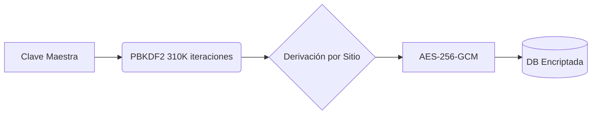

# 🔒 **EncryptU** - Gestor Automático de Contraseñas Seguras  

[](https://github.com/SiegAxel/EncryptU/actions)  [](https://opensource.org/licenses/MIT)  [](https://www.python.org/)  [](https://peps.python.org/pep-0008/)  


**Protege tus accesos con contraseñas únicas sin esfuerzo** - Ideal para usuarios no técnicos y personas mayores.  

---  

## 📌 **Tabla de Contenidos**  
- [🚀 Características](#-características)  
- [📦 Instalación](#-instalación)  
- [🛠️ Uso](#️-uso)  
- [🔐 Seguridad](#-seguridad)  
- [🧩 Módulos](#-módulos)  
- [📄 Documentación](#-documentación)  
- [🤝 Contribuir](#-contribuir)  
- [📌 Roadmap](#-roadmap)  
- [❓ FAQ](#-faq)  

---  

## 🚀 **Características**  
| Funcionalidad | Detalle |  
|---------------|---------|  
| **🔐 Encriptación por Sitio** | "pepito123" en Facebook ≠ "pepito123" en Gmail |  
| **📂 Almacenamiento Seguro** | Base de datos cifrada con AES-256 + SQLCipher |  
| **🤖 Autocompletado** | Integración con Chrome/Firefox (próximamente) |  
| **📲 Portabilidad** | Ejecutable .exe para Windows y Linux |  

---  

## 📦 **Instalación**  

### Requisitos  
- Python 3.10+  
- Sistema Operativo: Windows 10/11, Linux (Ubuntu/Debian)  

```bash  
# 1. Clonar repositorio  
git clone https://github.com/SiegAxel/EncryptU.git  
cd EncryptU  

# 2. Instalar dependencias  
pip install -r requirements.txt  

# 3. Generar ejecutable (opcional)  
pyinstaller --onefile src/main.py  
```  

> 📘 **Guía Completa**: [Ver Instrucciones Detalladas](docs/user-guide.md)  

---  

## 🛠️ **Uso**  

### Interfaz Gráfica  
```python  
python src/main.py  
```  


### Línea de Comandos (CLI)  
```bash  
encryptu-cli --site "facebook.com" --password "miClave123"  
# >> 🛡️ Contraseña cifrada: X9kL$2!vBn8*...  
```  

---  

## 🔐 **Seguridad**  
### Arquitectura de Protección  


### Políticas Clave:  
- 🔒 **Zero-Knowledge**: Nunca almacenamos tu clave maestra.  
- 🛡️ **Cifrado Autenticado**: Usamos AES-GCM para integridad.  
- 🕵️ **Auditorías**: Revisiones trimestrales de código.  

> ⚠️ **Reportar Vulnerabilidades**: [Ver Política de Seguridad](SECURITY.md)  

---  

## 🧩 **Módulos**  
| Directorio | Contenido |  
|------------|-----------|  
| `src/crypto` | Lógica de encriptación (AES, PBKDF2) |  
| `src/gui` | Interfaz gráfica con Tkinter |  
| `src/db` | Gestión de base de datos cifrada |  
| `tests` | Pruebas unitarias y de integración |  

---  

## 📄 **Documentación**  
| Recurso | Descripción |  
|---------|-------------|  
| [📚 Guía Técnica](docs/technical.md) | Diseño de sistema y flujos criptográficos |  
| [👤 Guía de Usuario](docs/user-guide.md) | Instalación y uso paso a paso |  
| [🤝 Cómo Contribuir](CONTRIBUTING.md) | Estándares de código y PRs |  
| [🛡️ Seguridad](SECURITY.md) | Reporte de vulnerabilidades |  

---  

## 🤝 **Contribuir**  
¡Tu ayuda es bienvenida! Sigue nuestro:  
1. [Código de Conducta](CODE_OF_CONDUCT.md)  
2. [Guía de Contribución](CONTRIBUTING.md)  

```bash  
# Configurar entorno de desarrollo  
git clone https://github.com/SiegAxel/EncryptU.git  
pip install -r requirements-dev.txt  
pytest tests/ -v  
```  

---  

## 📌 **Roadmap**  
- [x] **v1.0**: CLI Básico (Q4 2023)  
- [ ] **v1.5**: Interfaz Gráfica (Tkinter)  
- [ ] **v2.0**: Extensión para Navegadores  
- [ ] **v3.0**: Soporte Multiplataforma (macOS)  

---  

## ❓ **FAQ**  
### ¿Qué pasa si olvido mi clave maestra?  
❌ **No hay recuperación** - Por diseño de seguridad, tu clave nunca se almacena.  

### ¿Es compatible con móviles?  
📱 **Próximamente** - Versión Android en desarrollo (2024).  

### ¿Cómo verifico la seguridad?  
🔍 **Auditorías públicas** - Revisa nuestro [informe técnico](docs/technical.md#seguridad).  

---  

## 📜 **Licencia**  
MIT License © 2023 [SiegAxel](https://github.com/SiegAxel).  
Para detalles completos: [LICENSE](LICENSE)  

---

